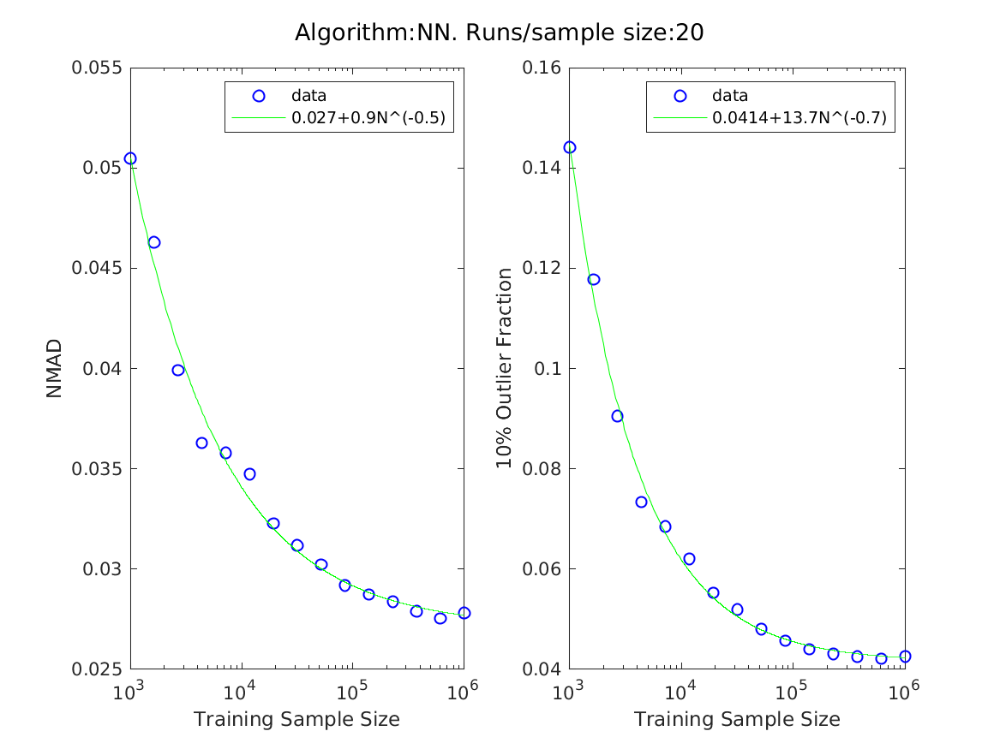
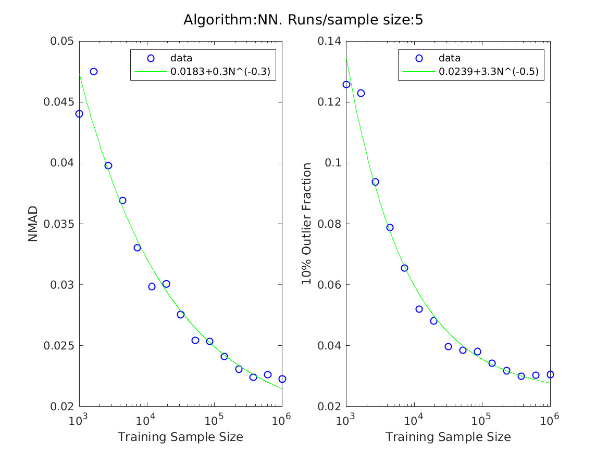
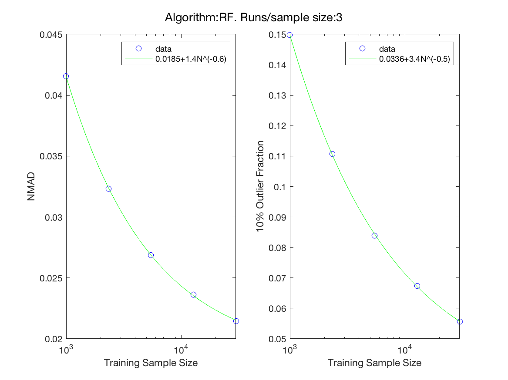
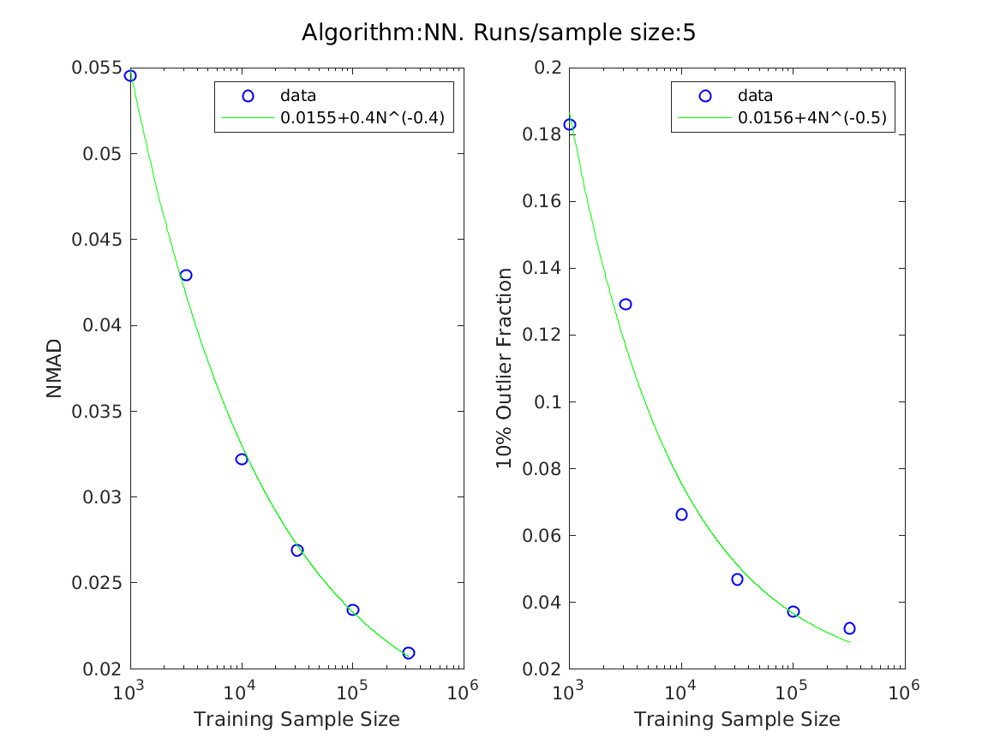

# Call python to use hf.file_ow
<!-- fs -->
fow = 'plots/errsNN.png';
command = strcat("python -c $'import helper_fncs as hf; hf.file_ow(\'",fow,"\')'");
status = system(command);

<!-- fe # Call python to use hf.file_ow -->

# .
<!-- fs -->
use data/data_proc.py to convert datasets for matlab input.
<!-- fe -->

# PCA analysis and Correlations plot
<!-- fs -->
[pca()](https://www.mathworks.com/help/stats/pca.html)
> returns the principal component coefficients
> Each column of coeff contains coefficients for one principal component, and the columns are in descending order of component variance
> By default, pca centers the data and uses the singular value decomposition (SVD) algorithm.
> note: % In \cite{gpz} they use principal component analysis to further pre-process the features, speeds up optimization.

[corrplot()](https://www.mathworks.com/help/econ/corrplot.html)
> creates a matrix of plots showing correlations among pairs of variables in X. Histograms of the variables appear along the matrix diagonal; scatter plots of variable pairs appear in the off diagonal. The slopes of the least-squares reference lines in the scatter plots are equal to the displayed correlation coefficients.

```Matlab
base_path = '/Users/troyraen/Korriban/Documents/photoz_errors/data/';
fdat = 'CGcolors1.mtxt'; Nexamples = 780953
dat = load(strcat(base_path,fdat));

coeff = pca(dat(:,3:end)) =
    0.7977   -0.5534   -0.2285   -0.0726   -0.0042   -0.0020
    0.5969    0.7661    0.1783    0.1568    0.0207    0.0004
    0.0852   -0.1745    0.8555   -0.4118   -0.2461   -0.0169
    0.0101   -0.2212    0.3991    0.4946    0.7049    0.2239
   -0.0066   -0.1591    0.1573    0.6848   -0.4525   -0.5255
   -0.0037   -0.0468    0.0088    0.2948   -0.4872    0.8206
addpath('../../matlab_functions')
ttl = 'PCA vectors';
col_lbls = {'pc1', 'pc2', 'pc3', 'pc4', 'pc5', 'pc6'};
row_lbls = {'u','u-g','g-r','r-i','i-z','z-y'};
writelatextable(ttl,col_lbls,row_lbls,coeff,4)

% test on larger dataset
fdat0 = 'CGcolors0.mtxt'; Nexamples = 3023057
dat0 = load(strcat(base_path,fdat0));
coeff0 = pca(dat0(:,3:end)) =
   0.7984   -0.5525   -0.2279   -0.0729   -0.0042   -0.0016
   0.5958    0.7670    0.1771    0.1580    0.0210   -0.0002
   0.0858   -0.1724    0.8553   -0.4130   -0.2462   -0.0175
   0.0103   -0.2214    0.4001    0.4943    0.7032    0.2278
  -0.0066   -0.1601    0.1582    0.6836   -0.4495   -0.5291
  -0.0036   -0.0466    0.0089    0.2959   -0.4923    0.8172
% results similar to fdat => using smaller dataset for following calculations

% CORRELATIONS
colnames = {'z','u','u-g','g-r','r-i','i-z','z-y'};
[R,PValue,H] = corrplot(dat(:,2:end), 'varNames',colnames);
gcf.PaperUnits = 'inches';
gcf.PaperPosition = [0 0 8 8];

% saved as base_path/corrplot.png
```


<!-- fe # PCA analysis and Correlations plot -->


# Scatter plot, most relevant features
<!-- fs -->
```python
import data_proc as dp
import numpy as np
import pandas as pd
import matplotlib as mpl
import matplotlib.pyplot as plt
df = dp.load_from_file(which='all')
cdf = dp.calc_colors(df.sample(100000))
cdf0 = cdf.sample(10000)

plt.figure()
plt.scatter(cdf0.r10_m_i10, cdf0.u10_m_g10, c=cdf0.redshift, alpha=0.25)
plt.xlabel('r-i')
plt.ylabel('u-g')
plt.colorbar(label='Redshift (z)')
plt.show(block=False)

plt.figure()
plt.scatter(cdf0.u10, cdf0.r10_m_i10, c=cdf0.redshift, alpha=0.25)
plt.xlabel('u magnitude')
plt.ylabel('r-i')
plt.colorbar(label='Redshift (z)')
plt.show(block=False)
```


<!-- fe # Scatter plot, most relevant features -->


# Scaling relation plot
```python
import numpy as np

N = np.logspace(3,6,1000)
plt.figure()
plt.plot(N, N)

```


# Final Plots:
<!-- fs -->

## All errors, 1 plot
<!-- fs -->
cd data
```python
import plot_errors as pe
import helper_fncs as hf
base_path = '/Users/troyraen/Korriban/Documents/photoz_errors/data/'
flist = ['errorsNN_2x10.mtxt', 'errorsNN_3x15.mtxt', 'errorsRF.mtxt', 'errorsGPz.mtxt']
lgnd = ['NN_2x10', 'NN_3x15', 'RF', 'GPz']
styl = ['c', 'b', 'g', 'r']
title = 'Errors in Photo_z estimates'
fout = base_path+'errors_plots/errors.png'
fout_ow = hf.file_ow(fout)
pe.plot_errors(base_path=base_path, flist=flist, lgnd=lgnd, styl=styl, title=title, fout=fout)
```


<!-- fe # All errors, 1 plot -->


## Individuals

<!-- fs -->
#### NN
__2x10__


__3x10__



#### RF


#### GPz


<!-- fe ## Individuals  -->

<!-- fe # Final Plots -->


# DEBUGGING and TESTING NOTES
<!-- fs -->

- [x] change # neural nets
- [x] look at RF settings
- [x] look at GPz


## - [x] Check RF
<!-- fs -->
use predict_photoz_testRF.m

[NumLearningCycles](https://www.mathworks.com/help/stats/fitrensemble.html#bvdwj92)
> At every learning cycle, the software trains one weak learner for every template object in Learners. Consequently, the software trains NumLearningCycles*numel(Learners) learners.

- [x] training cycles nlc100, nlc500, nlc1000
    - all very similar to each other. short runtimes.
    - all terminate normally after requested number of training cycles
    

- [x] Cross validation nlc500_CVon
    - very similar to CVoff case. no noticeable runtime difference
    


<!-- fe ## Check RF -->


## - [ ] Check NN
<!-- fs -->
use predict_photoz_testNN.m

- [ ] 3x50: # fout_tag = '3x50_e200mf50'
    - run next
    <!--  -->

- [ ] 3x15, poslin (RELU) transfer fnc # fout_tag = 3x15_e200mf50_transFposlin
    - run next
    <!--  -->


All with 2x10 and 3x15:
- [x] epoch 500 max_fail 100. errorsNN_2x10_e500mf100
    - looks good, can probably do max_fail=50 (didn't see any models that improved after that).
    

<!-- fe ## Check NN -->


## Check GPz: Trying to bring down [NMAD, out10] = 0.0424, 0.1584
<!-- fs -->
Code run from predict_photoz_testGPz.m

- [ ] csl 'balanced' (higher weight to rare samples) # fout_tag = 'mIt150_cslBalanced'
    - run next
    <!--  -->

- [ ] combine 1/(1+spec z) weighting with heteroscedastic=False (recommended for point estimates) # fout_tag = 'mIt150_cslNormalized_hetFalse'
    - run next
    <!--  -->


- [x] CURRENT BEST: more sample sizes and maxIter250, inNoisefalse # fout_tag = mI250_iNfls
    

- [x] Default Settings
    - 

- [x] maxIter = 500;
    - A BIT BETTER AS TRAINING SIZE INCREASES
    

- [x] csl_method = 'normalized'; (1/(1+spec z) weighting)
    - SIMILAR NMAD, 7% HIGHER OUT10 WITH HIGHER VARIANCE btwn sample sizes
    

- [x] heteroscedastic = false;
    - code notes say: "set to false if only interested in point estimates [default=true]"
    - 2-12% HIGHER NMAD, SIMILAR OUT10
    

- [x] maxAttempts = 200;
    - NO DIFFERENCE
    

- [x] try pre-packaged data. fdat = '../GPz/data/sdss_sample.csv';
    - BETTER ALL AROUND. not sure why, should investigate
    

- [x] inputNoise = false; use input errors as features
    - BETTER ALL AROUND.
    - shouldn't use this. still unsure where errors come from
    


- [x] check that input file was written correctly
- [ ] try with ugriz only


<!-- fe ## Check GPz: Trying to bring down [NMAD, out10] = 0.0424, 0.1584 -->


<!-- fe # DEBUGGING and TESTING NOTES -->


# Archive
<!-- fs -->


# Get and Plot errors data
<!-- fs -->
```Matlab
plotdir = '/Users/troyraen/Korriban/Documents/photoz_errors/matlab/plots';
datadir = '/Users/troyraen/Korriban/Documents/photoz_errors/data';
err_files = dir(strcat(datadir,'/errors*'));
% err_files = dir(strcat(datadir,'/errors*_ow_041919_1406.mtxt'));
num_files = length(err_files);
for i=1:num_files
    % Get algorithm name and error data:
    tmp = strsplit(err_files(i).name, '.');
    tmp = strsplit(tmp{1}, 'errors');
    tmp = strsplit(tmp{2}, '_');
    if max(size(tmp))>1 % get only most current/default file
        continue
    end
    algor = tmp{1}

    path = strcat(err_files(i).folder, '/', err_files(i).name);
    algor_errs = load(strcat(err_files(i).folder, '/', err_files(i).name));

    % Plot
    Nruns = 3;
    save = strcat(plotdir,'/errors_fit_',algor,'.png') % 0; % save to file
    plot_errors(algor_errs, algor, Nruns, save);
end
```
<!-- fe Get and Plot errors data -->


## - [x] NMAD, out10 don't make sense. Resolution: Korriban local file had unknown error.
<!-- fs -->
NMAD = 1.4651; out10 = 1 for fdat = '../data/CG_GPz.mtxt';
```Matlab
% fdat = '../GPz/data/sdss_sample.csv';
fdat = '../data/CG_GPz.mtxt';
Nexamples = [100000, 100000, test_N];
maxIter = 50;
[other, test_specz, mse, test_photz] = do_fitGPz(fdat, maxIter, Nexamples);
other % = [out10, diff_frout10] = 0.0260   -0.0000; 0.1584   -0.0000
zdev = calc_zdev(test_specz, test_photz);
[NMAD, out10] = calc_zerrors(zdev) % = 1.4653, 1; = 0.0231, 0.0260; 0.0424, 0.1584

```
- [ ] try with ugriz only
- [ ] try letting it set sample fractions


<!-- fe ## NMAD, out10 don't make sense -->


## Save errors to color data files
<!-- fs -->
```python
import data_proc as dp
df = dp.load_from_file(which='all')
cdf = dp.calc_colors(df)
```
<!-- fe ## Save errors to color data files -->


<!-- fe Archive -->
